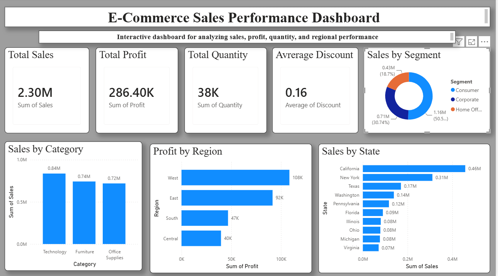

# 📊 E-Commerce Sales Analysis

## 📌 Project Overview

This project analyzes an E-Commerce sales dataset using **Python, SQL, and Power BI** to uncover valuable business insights. It demonstrates an end-to-end data analytics workflow, including data exploration, exploratory data analysis (EDA), SQL analysis, data visualization, and interactive dashboard development.

---

## 🎯 Objectives

- Analyze overall sales and profit performance.
- Identify top-performing product categories.
- Compare customer segments based on sales.
- Evaluate regional and state-wise business performance.
- Develop an interactive Power BI dashboard for business insights.

---

## 🛠️ Tools & Technologies

- **Python**
  - Pandas
  - Matplotlib
- **SQL**
- **Power BI**
- **Git & GitHub**
- **Visual Studio Code**

---

# 📂 Project Structure

```text
02_Ecommerce_Sales_Analysis/
│
├── data/
│   ├── raw/
│   └── cleaned/
│
├── notebooks/
│
├── powerbi/
│   └── E Commerce.pbix
│
├── reports/
│
├── sql/
│   └── ecommerce_analysis.sql
│
├── visuals/
│   ├── profit_by_region.png
│   ├── sales_by_category.png
│   ├── sales_by_segment.png
│   └── top10_subcategories.png
│
├── data_exploration.py
├── eda.py
├── run_sql.py
├── visualization.py
└── README.md
```

---

# 📊 Exploratory Data Analysis (EDA)

The analysis includes:

- 💰 Total Sales
- 📈 Total Profit
- 📦 Total Quantity Sold
- 🏷️ Average Discount
- 📊 Sales by Category
- 🍩 Sales by Segment
- 🌍 Profit by Region
- 🛒 Top Product Sub-Categories

---

# 📈 Power BI Dashboard

### KPI Cards

- 💰 Total Sales
- 📈 Total Profit
- 📦 Total Quantity
- 🏷️ Average Discount

### Dashboard Visualizations

- 📊 Sales by Category
- 🍩 Sales by Segment
- 📊 Profit by Region
- 📍 Sales by State

### Interactive Filters

- Region
- Category
- Segment

---

# 📸 Dashboard Preview

> Save your dashboard screenshot as **dashboard.png** inside the **visuals** folder.

```markdown

```

---

# 🚀 Key Insights

- Analyzed sales performance across different product categories.
- Compared customer segments based on their sales contribution.
- Evaluated regional and state-wise business performance.
- Identified key sales patterns using interactive visualizations.
- Built an interactive dashboard to support business decision-making.

---

# 💡 Skills Demonstrated

- Data Cleaning
- Data Exploration
- Exploratory Data Analysis (EDA)
- Data Visualization using Python
- SQL Analysis
- Power BI Dashboard Development
- Business Intelligence
- Data Storytelling
- Git & GitHub

---

# 📚 Learning Outcomes

Through this project, I gained practical experience in:

- Performing end-to-end data analysis using Python.
- Writing SQL queries for business reporting.
- Building interactive dashboards using Power BI.
- Creating meaningful visualizations for business insights.
- Organizing and documenting a complete analytics project using GitHub.

---

# 👩‍💻 Author

**Varshini G**

Aspiring Data Analyst

**GitHub:** https://github.com/varshinig297-alt